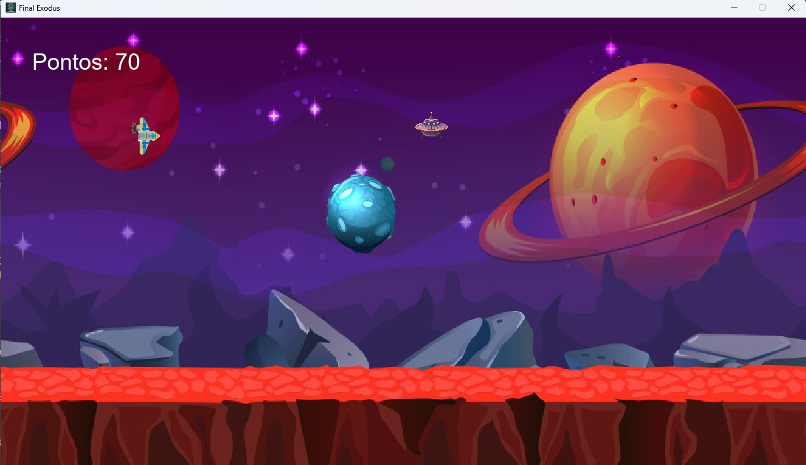

```markdown
# Final Exodus - Jogo no Pygame

Final Exodus é um jogo funcional criado com o propósito de estudo utilizando a biblioteca Pygame. O jogo consiste em uma nave espacial (controlada pelo jogador) que deve desviar de alienígenas e atirar neles para ganhar pontos. Quando a nave colide com um alienígena, o jogador perde pontos.

## Como Jogar 🚀
- **Setas para cima/baixo**: Movem a nave para cima ou para baixo.
- **Barra de espaço**: Atira um míssil na direção dos alienígenas.
- **O objetivo** é destruir os alienígenas para ganhar pontos enquanto evita colisões.

## Funcionalidades
✅ Detecção de colisão entre nave e alienígenas.
✅ Disparo de mísseis para destruir inimigos.
✅ Sistema de pontuação:

- Ganha pontos ao destruir alienígenas.
- Perde pontos ao colidir com um alienígena.

## Pré-requisitos
Antes de rodar o jogo, certifique-se de ter instalado:

- **Python 3.x**
- **Pygame** (instale com o comando abaixo)

```bash
pip install pygame
```

## Instalação

1️⃣ Clone o repositório:

```bash
git clone https://github.com/Murilonuness/Final-Exodus.git
```

2️⃣ Entre na pasta do jogo:

```bash
cd Final-Exodus
```

3️⃣ Instale as dependências:

```bash
pip install pygame
```

4️⃣ Execute o jogo:

```bash
python main.py
```

## Preview 🎮
Você pode visualizar o jogo em funcionamento através da imagem abaixo:



Caso tenha um vídeo de demonstração, você pode colocar o link aqui:

📹 **Vídeo de demonstração**

[](https://www.youtube.com/watch?v=yhymvDdb1yE)


## Estrutura do Projeto 📁

```bash
FinalExodus/
├── audio/
│   └── Demoiselle Döner - Une très mauvaise idée.mp3
├── images/
│   ├── bg.jpg
│   ├── icon.webp
│   ├── missil.png
│   ├── preview.jpg
│   ├── spaceship.png
│   └── nave.png
├── main.py
└── README.md
```

```bash
## Licença
Este projeto está licenciado sob a **Licença MIT** – veja o arquivo LICENSE para mais detalhes.
```